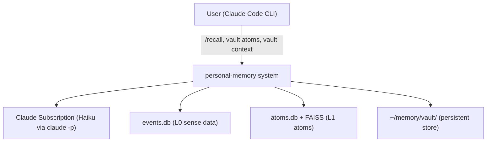
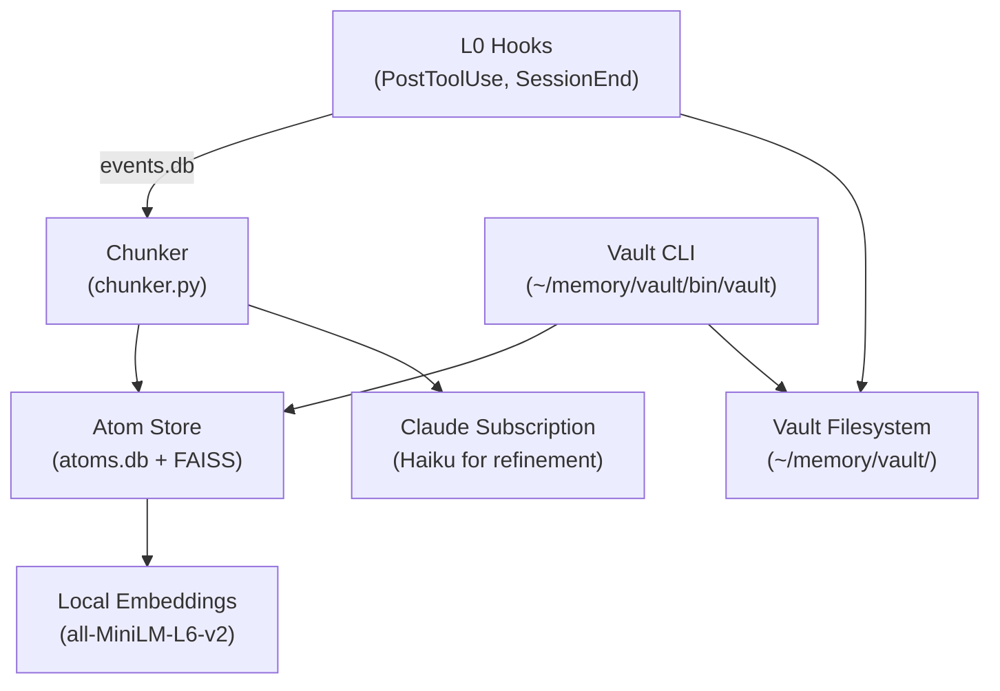

# System Map — personal-memory

Cross-session persistent memory system for Claude Code. Raw L0 sense data flows
in per tool call. A boundary-agnostic chunker aggregates L0 events into L1 atoms.
Atoms are queryable across sessions, projects, and working directories.

---

## System Context (C4 L1)

---

## Containers (C4 L2)

---

## Component Registry

| Component | Path | Role | Status |
|---|---|---|---|
| `postuse-event-logger.sh` | `~/.claude/hooks/` | L0: logs every tool call as SCAPE stimulus compound | active |
| `sessionend-db-update.sh` | `~/.claude/hooks/` | L0: writes messages, sequences, snapshots at session end | active |
| `sessionstart-snapshot.sh` | `~/.claude/hooks/` | L0: creates session row, start snapshot | active |
| `precompact-session-snapshot.sh` | `~/.claude/hooks/` | L1 episode + kicks chunker | active |
| `sessionend-session-summary.sh` | `~/.claude/hooks/` | L1 episode + kicks chunker on productive sessions | active |
| `postuse-git-episode.sh` | `~/.claude/hooks/` | L1 git-commit episodes | active |
| `chunker.py` | `~/memory/vault/scripts/` | L0→L1 aggregation: noise filter, pre-cluster, Haiku refine | active |
| `atom_store.py` | `~/memory/vault/scripts/` | SQLite + FAISS storage for L1 atoms | active |
| `vault` CLI | `~/memory/vault/bin/vault` | Query interface: chunk, atoms, context, recall, search | active |
| `/recall` skill | `~/.claude/skills/recall/` | User-facing semantic query + synthesis | active |
| `recall_query.py` | `~/memory/vault/scripts/` | FAISS retrieval + Haiku synthesis for /recall | active |
| `events.db` | `~/memory/vault/` | L0 raw event store (SQLite WAL) | active |
| `atoms.db` | `~/memory/vault/` | L1 atom store (SQLite WAL) | active |
| `atoms.faiss` | `~/memory/vault/` | FAISS vector index over atom content | active |

### Superseded (preserved, not active)

| Component | Path | Replaced by |
|---|---|---|
| `extractor.py` | `~/memory/vault/scripts/` | `chunker.py` |
| `fact_store.py` | `~/memory/vault/scripts/` | `atom_store.py` |
| `facts.db` | `~/memory/vault/` | `atoms.db` |
| `window_classifier.py` | `~/memory/vault/scripts/` | chunker noise filter |
| `deep_consolidate.py` | `~/memory/vault/scripts/` | L2+ (future) |
| `extract_sessions.py` | `~/memory/vault/scripts/` | direct L0 reads |

---

## Crosscutting Conventions

- **Vault root**: `MEMORY_VAULT` or `VAULT_DIR` env var; defaults to `~/memory/vault/`
- **LLM calls**: Haiku via `claude -p` with `env -u ANTHROPIC_API_KEY` (uses subscription)
- **Embeddings**: local `all-MiniLM-L6-v2` via sentence-transformers; never sent to API
- **Chunking key**: project, not session — atoms can span session boundaries
- **Concurrency**: chunker uses flock; concurrent triggers are safe
- **Atomic writes**: atoms.db uses WAL mode; FAISS rebuilt after batch
- **Provenance**: every atom carries denormalized metadata (no joins needed)

---

## Key Decisions

| Decision | Rationale |
|---|---|
| Boundary-agnostic chunking | Sessions are noisy boundaries (94% subprocess noise); content defines chunks |
| Haiku refines, doesn't discover | Heuristic pre-clustering is fast; Haiku confirms boundaries + produces atom text |
| Denormalized provenance per atom | Self-contained atoms readable without events.db joins |
| env -u ANTHROPIC_API_KEY for claude -p | ANTHROPIC_API_KEY forces API credits (depleted); subscription works |
| Local embeddings | Privacy + cost; API only for Haiku completions |
| SQLite WAL + FAISS dual store | SQLite for structured queries, FAISS for semantic search |
