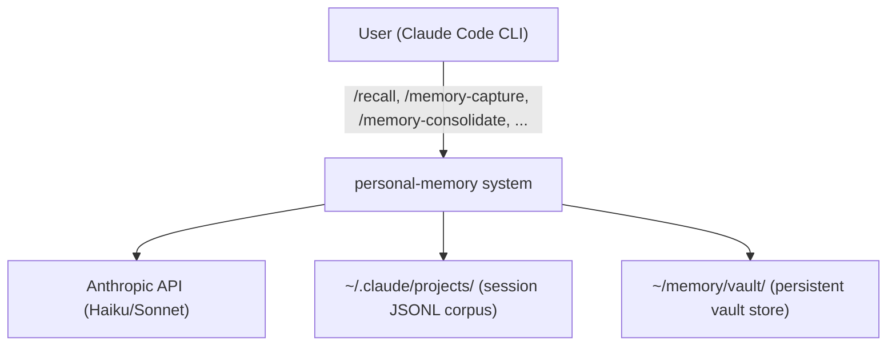
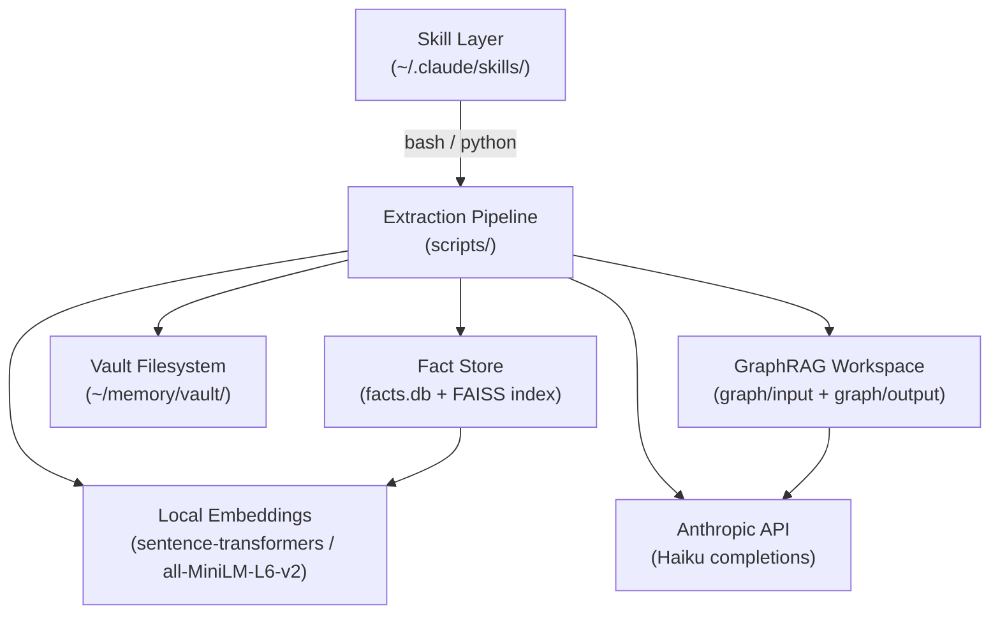

# System Map — personal-memory

Cross-session persistent memory system for Claude Code. Captures thoughts,
decisions, and Claude outputs into a structured vault — queryable across
sessions, projects, and working directories.

---

## System Context (C4 L1)

---

## Containers (C4 L2)

---

## Component Registry

| Component | Path | Role | Provenance |
|---|---|---|---|
| `/recall` skill | `skills/recall/SKILL.md` | Semantic query → Haiku synthesis; read-only | [derived] |
| `/memory-capture` skill | `skills/memory-capture/SKILL.md` | Write vault thread stub; append to INDEX.md | [derived] |
| `/memory-consolidate` skill | `skills/memory-consolidate/SKILL.md` | Inbox + history → Haiku → candidates | [derived] |
| `/memory-extract-sessions` skill | `skills/memory-extract-sessions/SKILL.md` | Session JSONL → chunks → GraphRAG index | [derived] |
| `/memory-deep-consolidate` skill | `skills/memory-deep-consolidate/SKILL.md` | GraphRAG community reports → vault candidates | [derived] |
| `/memory-review` skill | `skills/memory-review/SKILL.md` | Triage and review active threads | [derived] |
| `/memory-review-candidates` skill | `skills/memory-review-candidates/SKILL.md` | Walk pending candidate threads | [derived] |
| `/memory-ingest` skill | `skills/memory-ingest/SKILL.md` | Fetch URL → inbox stub | [derived] |
| `/memory-promote` skill | `skills/memory-promote/SKILL.md` | Graduate thread to destination | [derived] |
| `/memory-compile` skill | `skills/memory-compile/SKILL.md` | Compile threads into linked concept pages | [derived] |
| `window_classifier.py` | `scripts/window_classifier.py` | Sliding window LLM classifier; extracts atomic facts | [derived] |
| `fact_store.py` | `scripts/fact_store.py` | SQLite + FAISS storage; contradiction tracking | [derived] |
| `recall_query.py` | `scripts/recall_query.py` | FAISS retrieval + Haiku synthesis for `/recall` | [derived] |
| `extract_sessions.py` | `scripts/extract_sessions.py` | Session JSONL → exchange chunks → graph/input/ | [derived] |
| `deep_consolidate.py` | `scripts/deep_consolidate.py` | GraphRAG communities → scored candidates → vault | [derived] |
| `subagent_graphbuilder.py` | `scripts/subagent_graphbuilder.py` | Builds GraphRAG community graph | [derived] |
| `autoresearch_loop.py` | `scripts/autoresearch_loop.py` | Parameter sweep optimizer (target F1 ≥ 0.70) | [derived] |
| `local_st_embedding.py` | `scripts/local_st_embedding.py` | Sentence-transformers FAISS adapter | [derived] |
| `vault-template/` | `vault-template/` | Empty vault scaffold (inbox, raw, candidates, graph, compiled) | [derived] |
| `impressions-index.json` | `~/memory/vault/impressions-index.json` | Idempotency index for consolidation runs | [asserted] |
| `facts.db` | `~/memory/vault/facts.db` | SQLite fact store + contradiction queue | [asserted] |

---

## Crosscutting Conventions

- **Vault root**: `MEMORY_VAULT` or `VAULT_DIR` env var; defaults to `~/memory/vault/`
- **LLM calls**: Haiku (`claude-haiku-4-5-20251001`) for consolidation/classification; Sonnet for synthesis and `/recall`
- **Embeddings**: local `all-MiniLM-L6-v2` via sentence-transformers; never sent to API
- **Idempotency**: all pipeline runs keyed by `impressions-index.json`; safe to re-run
- **Atomic writes**: index updates use tmp + rename pattern throughout
- **Read-only sources**: session JSONLs and inbox stubs are never modified
- **Vault independence**: vault system operates independently of Cortex `.cortex/state.json`
- **Auto-promote gates**: score ≥ 0.65 AND session_count ≥ 2 AND week_span ≥ 2

---

## Key Decisions

| Decision | Rationale | Slug |
|---|---|---|
| GraphRAG architecture abandoned for window classifier | Prior GraphRAG loop achieved F1: 0.074 on contaminated eval set | knowledge-consolidation-engine |
| Local sentence-transformers for embeddings | Privacy + cost; Anthropic API used only for completions | knowledge-consolidation-engine |
| Haiku for consolidation, not Sonnet | Cost optimization for high-volume batch runs | knowledge-consolidation-engine |
| SQLite + FAISS dual storage | SQLite for structured metadata/contradictions, FAISS for vector retrieval | knowledge-consolidation-engine |
| 6-signal scoring for community auto-promotion | Multi-factor signal reduces false positives from single-metric auto-promote | knowledge-consolidation-engine |

---

## Active Work / Known Issues

- Window classifier F1 at 0.25 (target: 0.70); autoresearch loop running parameter sweep
- `community_reports.parquet` bootstrap failure — GraphRAG graph builder exited before completing
- 4 pending contradictions in `facts.db` — resolve via `/recall --pending`
